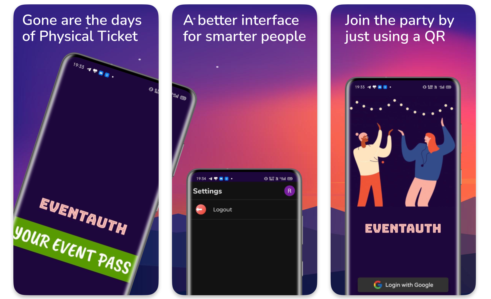
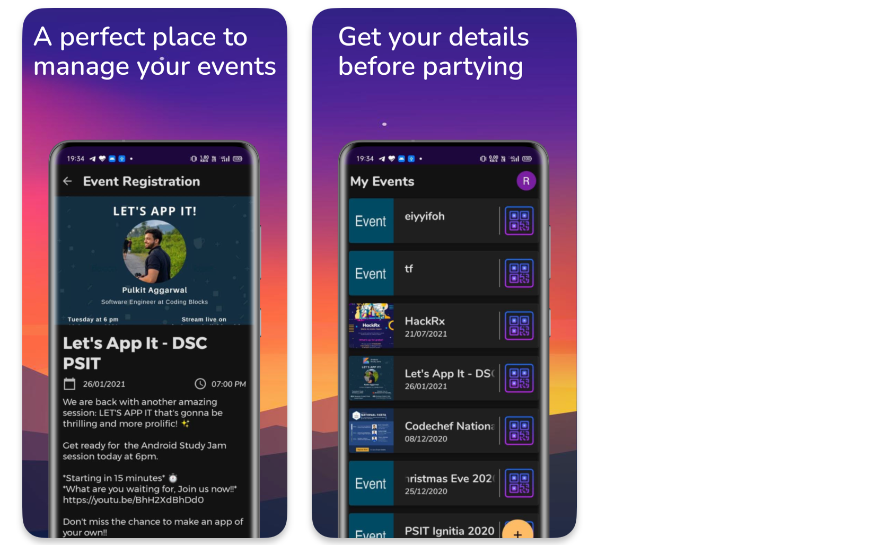

## EventAuth

**EventAuth** is an Android application designed to streamline event management for organizers by providing features for creating, organizing, and securely authenticating participants using QR codes.

### Screenshots

### Features

* **Event Creation:** Effortlessly create new events with customizable details like name, date, location, and description.
* **Participant Management:** Manage attendees by scanning QR codes generated during event registration within the app.
* **QR Code Authentication:** Securely authenticate participants using QR codes for a smooth check-in process.
* **Real-time Updates:** Get real-time updates and notifications for event activities and participant statuses.
* **User-friendly Interface:** Intuitive UI/UX design for easy navigation and interaction.

### Installation

1. Clone the repository using Git.
2. Open the project in Android Studio.
3. Build and run the app on an Android device or emulator.

**Requirements:**

* Android Studio
* An active development environment with Android SDK setup

### Usage

**1. Event Creation**

* Navigate to the "Create Event" section.
* Fill in event details like name, date, location, and description.
* Save the event to start managing participants.

**2. Participant Management**

* Use the built-in QR code scanner to check-in participants at the event venue.
* View and manage participant lists in real-time.

**3. Authentication**

* Participants present their unique QR code generated through the app for verification.
* Access is granted upon successful verification.

### Technologies Used

* Android SDK
* Firebase (Authentication, Realtime Database)
* QR Code Generation and Scanning Libraries - **ZXing** (Specific libraries to be mentioned upon integration)

### Amazon Appstore Published Link

[Downlaod here](https://www.amazon.com/dp/B0DVRKNR3Q/ref=apps_sf_sta)

### Contributing

We welcome contributions! If you'd like to contribute to EventAuth, please fork the repository and submit a pull request with your changes.

### License

This project is licensed under the MIT License.

### Support

For any questions or issues, please contact `ritikkanotra@gmail.com`.
